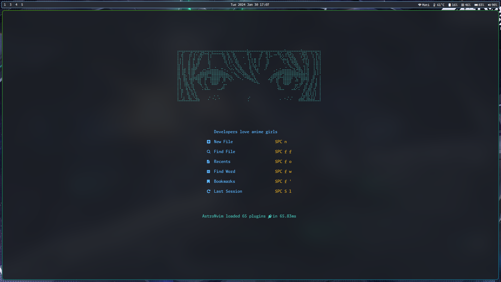
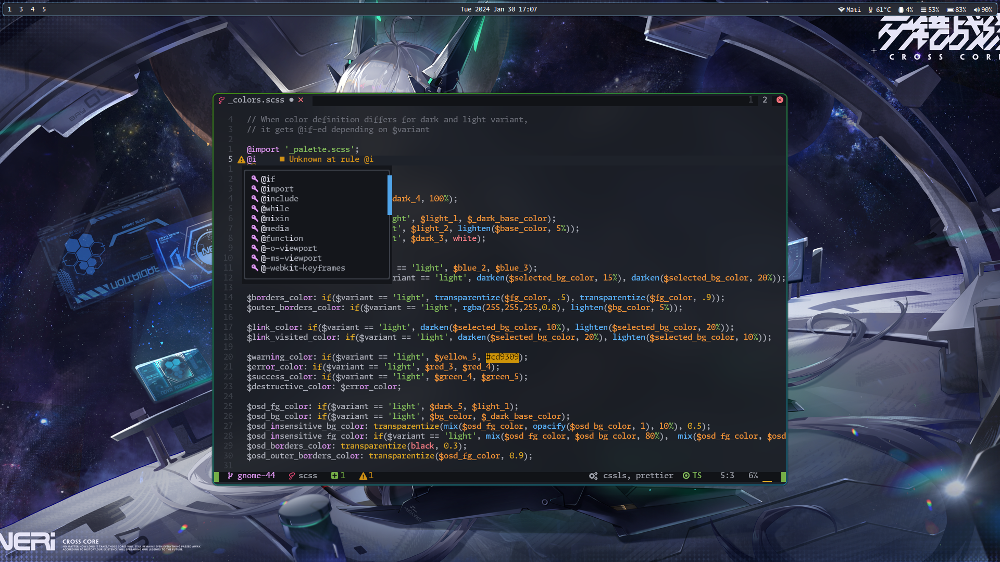
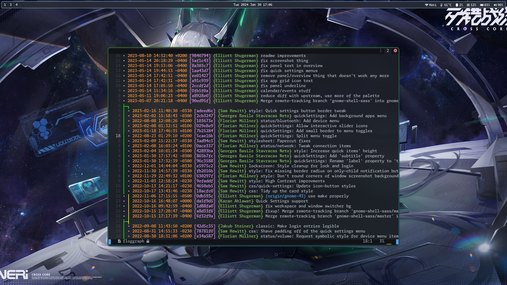
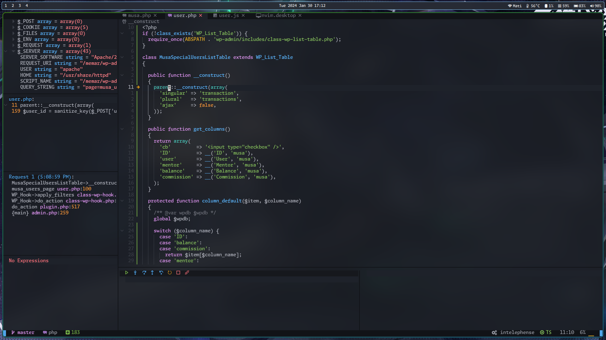

# AstroNvim User Configuration Example

My user configuration template for [Neovim](https://github.com/neovim/neovim) and [AstroNvim](https://github.com/AstroNvim/AstroNvim)



## 🍉 Features

- Code completion for various programming languages
- Language Server Protocol (LSP) support for diagnostics and debugging
- Formatting and linting for languages






## 🍇 Supported Languages

- PHP: Debugging, code completion, linting, and diagnostics
- TypeScript and JavaScript: Code completion, linting, and diagnostics
- CSS and HTML: Code completion, linting, and diagnostics
- Python: Debugging, code completion, linting, and diagnostics
- Rust: Debugging, code completion, linting, and diagnostics
- Lua (obviously)
- Bash: Diagnostics with shellcheck

## 🛠️ Installation

### Step 0: Install Dependencies

> I might forgot to include something here, if you somehow find out something's wrong let me know 🤪

- Install rustfmt using your distro package manager or `rustup`
- Install `stimulus-lsp` using npm: `npm i -g stimulus-lsp`

### Step 1: Install AstroNvim

To begin, make a backup of your current `nvim` and `shared` folders by running the following commands:

```shell
mv ~/.config/nvim ~/.config/nvim.bak
mv ~/.local/share/nvim ~/.local/share/nvim.bak
```

Next, clone the AstroNvim repository using the following command:

```shell
git clone https://github.com/AstroNvim/AstroNvim ~/.config/nvim
```

### Step 2: Create a User Repository

If you wish to customize the configuration, you need to fork this repository and make the necessary changes. If you want to use the configuration as-is without any modifications, you can skip this step and directly clone this repository into the `~/.config/nvim/lua/user` directory. Please note that this configuration is tailored to my own needs and may not work for your specific requirements.

To create a new user repository, press the "Fork" button above to create a new repository where you can store your user configuration.

Clone the repository using the following command, replacing `<your_user>` and `<your_repository>` with your own GitHub username and repository name:

```shell
git clone https://github.com/<your_user>/<your_repository> ~/.config/nvim/lua/user
```

If you decide to use my configuration without forking the repository, run the following command instead:

```shell
git clone https://github.com/taiwbi/AstroConfig.git ~/.config/nvim/lua/user
```

### Step 3: Start Neovim

Finally, start Neovim by running the following command:

```shell
nvim
```

Enjoy Neovim! 🤪

> For more information, please refer to the [AstroNvim documentation](https://docs.astronvim.com/).
